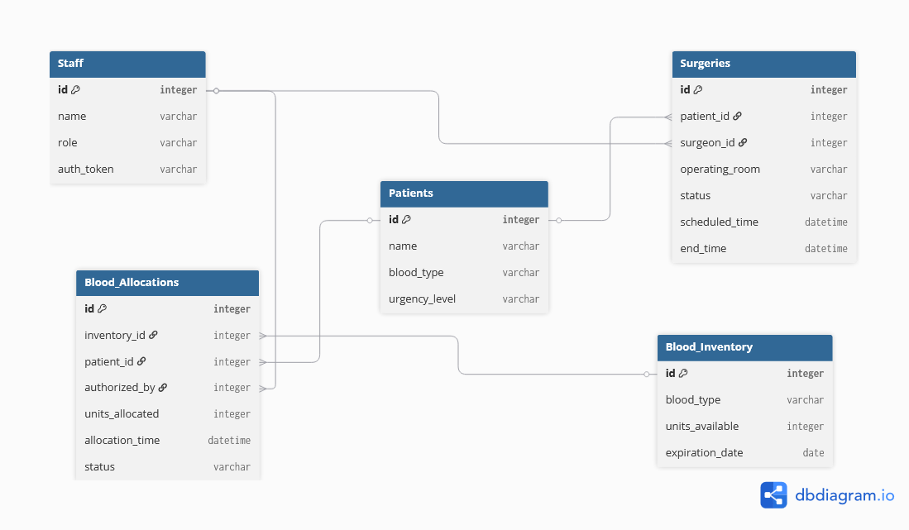

# Meridian Surgical & Blood Bank Allocation System

## 1. Company Overview

Meridian General Hospital is a fictional healthcare organization specializing in emergency surgery and blood bank management.

The hospital requires an AI assistant that can safely access operational data such as patient records, blood inventory, and surgery schedules — without giving the language model direct access to the production database.

---

## 2. Problem Statement

Medical staff need fast access to:
- Patient information
- Blood inventory
- Surgery schedules
- Hospital policies

However, providing an LLM with unrestricted SQL access introduces significant risks including:
- Invalid SQL generation
- Unauthorized data access
- Data modification
- Security vulnerabilities
- Lack of auditing

To address this, the system exposes a limited set of MCP tools through an MCP server sitting between the AI agent and the hospital database.

---

## 3. System Architecture

```text
User
  ↓
AI Agent
  ↓
MCP Client
  ↓
MCP Server
  ↓
SQLite Database
```

---

## 4. Database Schema

The database consists of the following tables:
- Staff
- Patients
- Blood_Inventory
- Surgeries
- Blood_Allocations

---

## 5. Entity Relationship Diagram



---

## 6. Seed Data

- Critical O-negative patient:
  - Jane Smith
  - Patient ID: 2
- Limited O-negative inventory:
  - Inventory ID: 2
  - Available Units: 2
- Blood Bank Director:
  - Dr. Elena Rostova
- Existing OR booking:
  - OR-1
  - 2026-07-28
  - 08:00–12:00

> **Note:** Seed data is used for development and demonstration purposes and may be updated during end-to-end integration testing.

---

## 7. MCP Protocol Concerns

Each protocol concern below exists because of a specific, real constraint in our problem — not as a checklist item. The **Status** column reflects where each piece stands as of this draft; the MCP server (`mcp_server/`) is still being built, so several rows will move from *Designed* to *Implemented* as that work lands.

| Concern | Why It's Necessary Here | Current Implementation | Status |
|---|---|---|---|
| **Capability Negotiation** | A client that silently ignores elicitation would let `allocate_blood` bypass the Blood Bank Director's approval with no warning. The server must confirm support *before* offering that tool. | `initialize` / `notifications/initialized` handshake; server checks the client declares elicitation support before exposing risky tools | Designed — client-side check implemented in `agent/client.py`; server-side gating pending `mcp_server/server.py` |
| **Notifications** | Staff roles change mid-shift (a nurse's session can become a surgeon's). We can't ask someone to disconnect and reconnect during an emergency. | `tools/list_changed` pushed when role changes; new tools (`allocate_blood`, `schedule_surgery`) appear without a reconnect | Designed — pending server implementation |
| **Elicitation** | O-Negative is our scarcest resource — 2 units on hand at seed time. Allocating it without human sign-off risks depleting the supply with no accountability. | `elicitation/create` fires mid-call inside `allocate_blood` when the resolved blood type is O-Negative, pausing for the Blood Bank Director's explicit approval | Designed — client-side handler implemented; server-side trigger pending |
| **Resources** | The Emergency Transfusion Policy encodes compatibility rules, urgency tiers, and temperature thresholds — too much to safely wrap in a single function's return value. | Exposed via `resources/read` as a static, versioned document the model reads once and reasons over | Designed — pending server implementation |
| **Sampling** | Determining transfusion urgency means cross-referencing live lab values against the policy document — that's reasoning, not a lookup. | Server calls back into the *client's* model via `sampling/createMessage` to classify urgency | Designed — pending server implementation |
| **Progress Tracking** | A crossmatch search against the regional blood database genuinely takes several seconds. A silent wait reads as a crash to time-pressured staff. | `run_crossmatch_compatibility` streams `notifications/progress` instead of blocking | Designed — pending server implementation |
| **Defensive Tool Design** | An operating room can't be double-booked — the cost of a scheduling conflict is too high to trust to the model's own claims. | `schedule_surgery` re-validates OR availability server-side (`check_operating_room_availability`), independent of what the client requests | Implemented at the database layer (`mcp_server/database.py`); MCP-level tool wrapper pending |
| **Prompts** | Staff repeatedly need to draft the same kind of surgical transfer summary — reinventing that prompt per client wastes effort and risks inconsistency. | `draft_surgical_transfer_summary`, a reusable, parameterized prompt template | Designed — pending server implementation |
| **Transport** | Local development needs simplicity; a multi-location hospital deployment needs a real remote connection. | Stdio during development → Streamable HTTP planned for deployment | Stdio in use now; HTTP transport not yet started |

---

## 8. MCP Tools

Full input schemas, required fields, and validation rules for every tool are documented in [`mcp_server/TOOLS_SPEC.md`](mcp_server/TOOLS_SPEC.md) — this section summarizes scope only.

### Read-Only Tools
- `get_patient_vitals()`
- `check_blood_inventory()`

### Write Tools
- `allocate_blood()`
- `schedule_surgery()`

### Long-Running Tools
- `run_crossmatch_compatibility()`

### Comparison Note

| Question | Answer |
|---|---|
| Which tools are read-only? | `get_patient_vitals`, `check_blood_inventory`, and the Emergency Transfusion Policy resource never modify state. |
| Which tools write? | Only `allocate_blood` and `schedule_surgery` — both are scoped to the Surgeon role and both re-validate server-side before committing. |
| Which tool requires elicitation, and why? | `allocate_blood`, but only when the resolved blood type is O-Negative — our scarcest inventory. Every other blood type completes immediately; the friction exists only where the real risk is. |
| What happens if a client connects without a required capability? | A client that doesn't declare elicitation support never sees `allocate_blood` in its tool list — it receives a read-only fallback instead of a broken or silently-bypassed approval flow. |

---

## 9. Defensive Tool Design

The system implements:
- Parameterized SQL queries
- Server-side validation independent of the client's claims
- Authorization checks at the handler level, not just the schema level
- Double-booking prevention for operating rooms
- Restricted tool visibility based on user role

---

## 10. Demo Scenarios

A fixed set of test inputs (`agent/demo.py`) is used across every run so results are repeatable, not a lucky pass:

1. Nurse connects — receives read-only tools only.
2. Surgeon authenticates mid-session — `tools/list_changed` unlocks privileged tools.
3. O-Negative blood allocation — triggers elicitation and pauses for Director sign-off.
4. Double-booking attempt on OR-1 — rejected server-side.
5. Crossmatch compatibility search — progress notifications stream instead of blocking.
6. Emergency Transfusion Policy resource — read as data, not called as a function.
7. `draft_surgical_transfer_summary` prompt — reusable template returned.
8. Client without elicitation capability — safe read-only fallback, no crash.

> **Note:** Scenarios are implemented and runnable against the client in isolation today. End-to-end runs against the real MCP server are pending `mcp_server/server.py`.

---

## 11. Team Responsibilities

| Member | Responsibility |
|---|---|
| Person 1 | Database (`db/`, `mcp_server/database.py`) |
| Person 2 | MCP Server (`mcp_server/server.py`, `tools.py`, `auth.py`, `validation.py`, `notifications.py`, `resources.py`, `prompts.py`, `transport.py`) |
| Person 3 | Agent, Demo, README (`agent/`, this document) |

---

## 12. Transport

### Development
- Stdio — local child process, no network overhead, used for all current development and testing.

### Planned Deployment
- Streamable HTTP — required once the system moves beyond a single local clinic setup; supports multiple concurrent clients and real authentication (OAuth / API keys / bearer tokens).

---

## 13. Setup & Running

> **Note:** These instructions reflect the current state of the repo. Steps involving `mcp_server/server.py` will only run end-to-end once Person 2's server implementation is complete.

### Requirements
```bash
pip install -r requirements.txt   # mcp SDK, python-dotenv, etc.
```

### Environment
Create a `.env` file in the project root (never committed — see `.gitignore`):
```dotenv
MCP_TRANSPORT=stdio
MCP_SERVER_SCRIPT=../mcp_server/server.py
STAFF_TOKEN=token_nurse_123
```

### Initialize the database
```bash
python db/init_db.py
```

### Run the demo scenarios
```bash
cd agent
python demo.py
```

---

## 14. Future Work

- Complete MCP server integration (`mcp_server/server.py`).
- Wire `_handle_sampling` in `agent/client.py` to a real model provider.
- Enable remote deployment over Streamable HTTP.
- Add the final demo transcript/recording.
- Add screenshots of successful MCP interactions.
- Expand blood bank workflows (e.g. regional backup requests).
